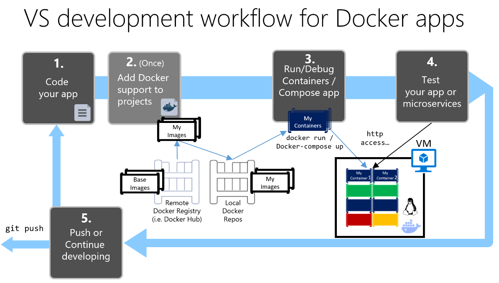

## Workflows
- Si queremos un repositorio compartido entre varios usuarios necesitamos crear una organización
- Desde Junio 2021 los [autobuilds](https://docs.docker.com/docker-hub/builds/) son de pago
  - Si usamos GitHub podemos usar **GitHub Actions**


## Nuestro propio registro

- Docker viene configurado por defecto para buscar las imágenes de Docker Hub
- Es posible usar nuestro propio registro:
  - Podemos usar la misma **implementación vanilla del Docker registry** que usa Docker Hub
  - Otros más avanzados como Harbor (Open Source, era VMWare), Artifactory (JFrog), Nexus (Sonatype), etc.


## Otros registros

- Docker también ofrece una versión enterprise de su registro llamada Docker Trusted Registry (DTR)
- Google Container Registry (GCR), Amazon Elastic Container Registry (ECR), Azure Container Registry (ACR), Quay (Redhat, versión On-Prem y versión cloud), Gitlab Container Registry, Github Packages, etc.


## Repositorios
- Pueden ser públicos o privados (1 gratis)
- Se crean desde Docker Hub
- Cada repo  puede tener una o varias imágenes, en función de la tag
- Las imágenes se publican mediante el comando
  ```
  docker push <hub-user>/<repo-name>:<tag>
  ```
- Se  pueden consultar  mediante  ``` docker search <keyword>```
  - Lo más  habitual es hacerlo vía web, no con consola


# Prácticas DockerHub


## Práctica 1

- **redis y redis-commander dockerizados**
  - Evitamos problemas de dependencias
  - las máquinas host se quedan "limpias"


## redis-comander

- [Paquete de npm](https://www.npmjs.com/package/redis-commander) para acceder a Redis desde el navegador
- Instalación:
  - Debemos instalar  nodejs, la versión de la distribución de Ubuntu es antigua (v10)
  -  Instalamos usando el PPA oficial

```
sudo curl -sL https://deb.nodesource.com/setup_14.x -o nodesource_setup.sh
sudo bash nodesource_setup.sh
sudo apt-get install -y nodejs
node --version
sudo npm i -g redis-commander
redis-commander
```


## Comunicación entre contenedores

- Queremos que se comuniquen entre sí utilizando **redes bridge**:
  - **default**: las que utilizabamos hasta  ahora
  - **user defined**: 
    - Interacionan solo los contenedores definidos en esta red
    - Hay resolución de nombres


## User defined vs default bridge


## Buscar imagen  en Docker Hub
- Opciones
  - Construir nuestra propia imagen (todavía no sabemos)
  - Utilizar una imagen ya preparada  en Docker Hub:
    - Menos propenso  a errores
    - Más rápido
  - Modificar una imagen ya preparada:
    - ¿Dockerfile? ¿FROM?


## User defined network

- Creación de red:

```
# docker network rm my-net
docker network create my-net
```

- Uso de red:

```
docker create --name my-nginx \
  --network my-net \
  --publish 8080:80 \
  nginx:latest
```


## Solución

```
docker network create redis-net
docker run --rm --name redis --network redis-net -d redis
docker run --rm --name redis-commander --network redis-net  -d \
  --env REDIS_HOSTS=redis \
  -p 8081:8081 \
  rediscommander/redis-commander:latest
```

- Comprueba que efectivamente funciona (*docker log*)
- Entra a uno de los dos contenedores y comprueba el ping por *name*


## Práctica 2

- Monta un escenario como  el anterior con MySQL o MariaDB y phpMyAdmin


## Práctica  3

- Comprueba las versiones de imágenes de httpd
  - ¿Vía web?
  - ¿Vía docker  search?


## Práctica 3 - opciones
- *docker search* no nos sirve
- *Vía web* aunque es algo "laborioso"
- Prueba y error con la versión que queremos
- Usando [hub tool](https://www.docker.com/blog/docker-hub-experimental-cli-tool/)
```
  hub-tool tag ls <repo-name>
```


## Práctica 4

- Ejecuta una imagen 2.2 de Apache en DockerHub y modifica el index.html para que aparezca HolaMundo
  - ¿Cómo has modificado el index.html?


## Práctica 4 -  opciones

- Instalando en el contenedor  un editor y entrando mediante:
```
docker exec -it <container> bash
```
- Mediante el [comando cp de Docker](https://docs.docker.com/engine/reference/commandline/cp/)
- Mediante  el plugin Docker de Visual Studio Code (lo más sencillo)


## Práctica 5

- Imagina que hay un  bug importante en Apache que está arreglado en la versión 2.4
- Actualiza la versión  de  nuestra aplicación  HolaMundo anterior a Apache2.4


## Práctica 5 -  opciones

- Las dos opciones  más adecuadas serían:
  - Generar una nueva imagen de nuestra aplicación
    - No sabemos hacerlo todavía
    - Realmente tampoco lo habíamos hecho, utilizabamos directamente la imagen de Apache
  - Buscar persistencia de algún modo en nuestro contenedor efímero.
    - Usámos volúmenes o bind-mounts


## Volúmenes

- Docker gestiona el volumen de forma transparente
```
  docker-volume ls
  docker volume  rm <volume-id>
  docker volume inspect <volume-id>
```

- Ejemplo  con nginx:
```
  docker run -d --name=nginx -v nginx-vol:/usr/share/nginx/html nginx:latest
```


## Bind mounts

- El volumen se mapea a un directorio físico acccesible no solo por Docker.
- Si el directorio no existe, se crea.

```
docker run -d --name=nginx -v ./nginx-web:/usr/share/nginx/html nginx:latest
```


# Construcción imágenes en Docker (1)


## Objetivos

- Aprender a crear ficheros Dockerfile
- Aprender  a crear y publicar imágenes
- Entender el concepto de layers en imágenes.


## ¿Qué es un dockerfile?

- Plantilla en texto plano que define las dependencias de mi aplicación y la imagen.
- Cada línea del fichero Dockerfile contiene una serie de comandos que generan una capa en la imágen
  - Se ejecutan de manera secuencial
  - Existe una caché que funciona por cada línea o capa.
- Es habitual que las imágenes se creen en base a otras (herencia)


## Concepto de capas

- Una  imágen es un conjunto  de capas de solo lectura, generadas por el Dockerfile
- ¿Qué es un contenedor?
  - Una  imagen en ejecución
  - Una imágen con una capa de lectura/escritura encima del resto de capas llamada  **container layer**
- Cualquier cambio que hagamos en un contenedor, se  lleva a cabo  en la **container layer**


## Ejemplo

- Vamos a crear una imagen que visualice el contenido de un fichero al ejecutar el contenedor
- Crea un directorio y coloca un fichero *holaMundo.txt* con el texto  *¡Hola Mundo!*
- Crea un fichero *Dockerfile* en el mismo directorio con el siguiente contenido:

```
FROM ubuntu:latest
RUN mkdir -p /app
COPY holaMundo.txt /app/holaMundo.txt
RUN chmod 600 /app/holaMundo.txt
CMD cat /app/holaMundo.txt
```


- Creamos la imagen y etiquetamos:
```
  docker build -t <dockerHubUserName>/holaMundo .
  docker tag  <dockerHubUserName>/holaMundo:1
  docker tag  <dockerHubUserName>/holaMundo:1.0
  docker tag  <dockerHubUserName>/holaMundo:1.0.0
  docker image ls
  ```
- Ejecutamos la imagen:
  ```
  docker run <dockerHubUserName>/holaMundo
  ```
- Subimos la imagen con todas sus tags
  ``` 
  docker push -a <dockerHubUserName>/holaMundo
  ```


## Análisis Dockerfile

- FROM nos sirve para partir de una imagen previa
- RUN: ejecuta comandos 
- COPY: copia ficheros de nuestro contexto a la imagen
- CMD: Ejecuta un comando al iniciar el contenedor
- Más info en las [referencias de Dockerfile](https://docs.docker.com/engine/reference/builder/)


## Explorar capas

- Podemos  ver las capas también mediante *docker inspect* y *docker history*
  - No todos los pasos generan una nueva capa, algunos comandos solo alteran configuración (CMD, ENV, ENTRYPOINT, EXPOSE, etc.).

- La herramienta Dive nos sirve para explorar con más detalle las capas de las imágenes de Docker
https://github.com/wagoodman/dive


## Cache

- Las líneas del Dockerfile en principio se cachean
- Si se produce un MISS ya no se usa más caché en esa compilación
  - Escribir las líneas más "frecuentes primero"
  - Si hay líneas "con dependencias", ej apt-get update y apt-install juntas.

- Si no queremos caché (ni para *FROM image*):
```
docker build --no-cache --pull -t myApp .
```


# PRACTICAS IMÁGENES


## PRACTICA 1

- Crea una imagen que se base en Ubuntu y que permita:
  - Editar ficheros con vim
  - Ejecutar el comando ping


## Solución

- Observa el *-y* para  evitar la parte interactiva del comando *apt-get install*

```
FROM ubuntu:latest
RUN apt-get update
RUN apt-get install -y vim iputils-ping
```


- Comprueba con dive los recursos  utilizados

```
docker build -t test .
dive test
```


## Mejor solución

```
FROM ubuntu:latest
RUN apt-get update && apt-get install -y --no-install-recommends \
  vim \
  iputils-ping \
  && rm -r /var/lib/apt/lists/*;
```


## ¿Qué falla aquí?

```
FROM ubuntu:latest
RUN apt-get update && apt-get install -y --no-install-recommends \
  vim \
  iputils-ping
RUN rm -r /var/lib/apt/lists/*; \
```


## PRÁCTICA 2
- Crea una imagen a partir de las instrucciones del ejercicio anterior (vim + ping) pero con el comando [docker commit](https://docs.docker.com/engine/reference/commandline/commit/)
- Verifica la imagen (capas y tamaño)


## PRÁCTICA 3

- Vamos  a crear una  versión v2.0 de nuestro holaMundo, que en vez de coger el fichero de local lo coja de una URL mediante el comando [ADD](https://docs.docker.com/develop/develop-images/dockerfile_best-practices/#add-or-copy)
- Compila la imagen y ejecútala
- Cambiaremos los datos del fichero apuntado por la URL
- Compila de nuevo la imagen y ejecuta otra vez
- ¿Qué pasa? ¿Comó lo solucionas?


# Construcción imágenes en Docker (2)


## Almacenamiento

- En docker, las imágenes se construyen a base de capas
- Cada capa contiene únicamente las diferencias respecto a la capa padre. 
- Docker utiliza mecanismos de union filesystems para montar en una carpeta la combinación de las distintas capas.


## Almacenamiento

- Al crear un contenedor, Docker añade una capa adicional (la capa de contenedor), que es la única sobre la que es posible escribir.
- El contenedor modifica aparentemente la imagen base, como si tuviera una copia real, pero únicamente está modificando esta última capa. 
- Podemos crear múltiples contenedores sobre una misma imagen, reutilizando todas las capas excepto la capa de contenedor.
- Al destruir un contenedor, esta capa con las modificaciones se destruye.


## Tamaño de las imágenes

-  Borrar un archivo en un paso del Dockerfile no elimina ese archivo de las capas anteriores de la imagen. 
   - El archivo sigue presente, pero no es accesible desde el contenedor.
   - Es la forma de comportarse de los union filesystems

   ```
    FROM ubuntu
    RUN apt-get install alguna-herramienta
    RUN algo-que-utiliza-la-herramienta para compilar o hacer algo
    RUN apt-get remove alguna-herramienta
    ```


## Build Context

- Al hacer un build se envían al daemon docker los ficheros de la ruta especificada como contexto: 

``` 
# En este caso el contexto es ".", el directorio actual:
$ docker build -t myimage -f Dockerfile .
```
- Es recomendable usar una carpeta separada para almacenar el contexto.
- Podemos crear un fichero *.dockerignore*

```
# contexto vacío, si no necesitamos añadir ficheros al contenedor, mediante "-"
docker build -t myimage -f Dockerfile -
```


## Tipos de imágenes
  - **Used**: Las que aparecen al hacer un  *docker ps  -a*
  - **Unused**: Las que no aparecen (se usaron en su momento pero se ha borrado el contenedor)
  - **Dangling images**:  Imágenes  que se crean sin  nombre, y se muestran como  **\<none\>**.
    - Útil  cuando  estamos haciendo pruebas de compilación


## Gestión de espacio

- Conforme vamos usando  docker, descargando imágenes... empezamos a ocupar  espacio
- Comprobar el espacio usado: 
```
docker system df 
```
- Eliminación de imágenes:
  
```
  docker system prune  -a #  unused  y  dangling images
  docker system prune # dangling images
```


## Multistage builds

- Se crea la  primera  imagen que sirve para obtener lo que se usa en  el segundo stage  (ver --from=n)
- Todo lo que no se usa  queda  fuera del  último stage que es el definitivo
  - Útil  para entorno de compilación
  - Se reduce el tamaño final de la imagen al quedarnos solo con el ejecutable


## Ejemplo multistage

```
# syntax=docker/dockerfile:1
FROM golang:1.16
WORKDIR /go/src/github.com/alexellis/href-counter/
RUN go get -d -v golang.org/x/net/html  
COPY app.go ./
RUN CGO_ENABLED=0 GOOS=linux go build -a -installsuffix cgo -o app .

FROM alpine:latest  
RUN apk --no-cache add ca-certificates
WORKDIR /root/
COPY --from=0 /go/src/github.com/alexellis/href-counter/app ./
CMD ["./app"]  
```


# Docker Compose


## Qué es Docker Compose

- Herramienta para definir  y ejecutar aplicaciones con varios contenedores Docker.
- Se definen los contenedores (servicios) de la aplicación mediante un fichero  YAML.
- Se levantan mediante el comando ```docker-compose up```


## Prueba de uso

- [Referencia de uso](https://docs.docker.com/compose/compose-file/compose-file-v3/)
- Vamos a analizar un caso sencillo con 3 contenedores:
  - web server con  php
  - db con MySQL
  - phpMyAdmin
- Clona [este repositorio](https://github.com/juanda99/practica-docker-compose-php/blob/main/docker-compose.yml)


## Docker-compose con Image
- Óptimo para producción, más rápido que un build y todo *empaquetado*
- Crea una imagen de Apache con un HolaMundo
- Ejecútala mediante docker-compose.yml


## Proxy  inverso
-  Para dar un  servicio externo, en web el  puerto es el 80
-  ¿Cómo hacemos para que los servicios anteriores funcionen todos en el 80?
    - Proxy inverso en función de la url
    - Similar a un virtual host  de apache pero que se configura solo en función de las peticiones que le llegan al docker daemon
    - Usaremos [nginx-proxy](https://github.com/nginx-proxy/nginx-proxy) o  [traefik](https://github.com/traefik/traefik)


## Práctica ODOO

-  Seleccionar en DockerHub una imagen de Odoo
-  Desplegar la imagen con  la  bbdd adecuada como servicios (usando  *docker-compose.yml*)


## Práctica Dolibarr

-  Seleccionar en DockerHub una imagen de Dolilbarr 
-  Desplegar la imagen con  la  bbdd adecuada como servicios (usando  *docker-compose.yml*)


##  Práctica Wordpress
  - En la web de Docker hay [ejemplos de Wordpress, Django o Rails](https://docs.docker.com/samples/wordpress/)
  - [Repo con wp-cli, copias de seguridad o caché](https://github.com/juanda99/wordpress-docker)


## Mooodle

- [Ver ejemplo de Catedu](https://github.com/catedu/moodle-docker-production)


## Problema de espera entre contenedores
 - Una buena forma es usar [dockerize](https://github.com/jwilder/dockerize)
   - [Ejemplo de uso](https://github.com/catedu/moodle-docker-production/blob/master/apache/3.7.6/docker-entrypoint.sh#L101)
   - Instalación:

```
RUN curl -o dockerize.tar.gz -fSL "https://github.com/jwilder/dockerize/releases/download/${DOCKERIZE_VERSION}/dockerize-linux-amd64-${DOCKERIZE_VERSION}.tar.gz"; \
	tar -xf dockerize.tar.gz -C /usr/local/bin; \
	rm dockerize.tar.gz
```


## crontab
- ¿Añadir  un servicio de crontab a nuestro contenedor?
  - ¡¡¡no!!! Filosofía docker: 1 contenedor = 1 servicio
- Podemos crear un crontab en el host con comandos como:
   
   ```
   docker exec -it <containerId> <command> 
   docker run --rm <containerId> <command>
   ```


- Usar soluciones ya preparadas: [Ofelia](https://github.com/mcuadros/ofelia)


## Práctica copias de seguridad
- Propongo  uso de  [rsnapshot](https://rsnapshot.org/)
  - rsync para hacer instantáneas con hard links
- Interfaz gráfico para su gestión
- Y para hacer deploy en Docker
- ¿Existe esto?
  - [ELKAR backup](https://www.elkarbackup.org/)


## Datos en docker

- Ver  uso  contenedores
```
docker stats --no-stream
```

- Procesos en ejecución
  
  ```
  docker  top <container_id>
  ```

- Consultas al demonio de docker
- Consultas específicas por contenedor
```
docker exec -it <container-id> top
```
- Configuraciones intrínsecas a los servicios (por ej. mod_status en Apache)


## Gestión de la  memoria

- El kernel si no tiene suficiente memoria arroja  un  **OOME (Out of memory exception)**.
  - Empieza a matar procesos para liberar memoria
  - Puede tirar todo el sistema si mata el proceso equivocado (por ej. el demonio de Docker)
- Docker ajusta la prioridad de OOM del demonio para reducir la probabilidad de recibir un kill.


## Gestion de memoria de los contenedores

- La prioridad de los contenedores no se debe ajustar.
  - El host debe tener suficiente memoria
  - Para evitar errores se  debe **limitar el uso de memoria de los contenedores**


## Ejemplo configuración

- La configuración cambia bastante entre versiones de docker-compose

```
services:
  service:
    image: nginx
    deploy:
        resources:
            limits:
              cpus: 0.50
              memory: 512M
            reservations:
              cpus: 0.25
              memory: 128M
```


# Workflow con docker


## Desarrollo con  Vagrant

- Buena opción si trabajamos en equipos Windows y no queremos preocuparnos de despliegues
- Descargamos Vagrant
- Configuramos Vagrant (ver después) o hacemos un git clone de https://github.com/juanda99/vagrant-deploy-virtualbox-docker


  
## Configuración Vagrant-Virtual Box

- Nos situamos en  un  directorio e inicializamos mediante ```vagrant init```
- Modificamos el fichero  Vagrantfile creado con algo como:
  ```
  # Every Vagrant development environment requires a box. You can search for
  # boxes at https://vagrantcloud.com/search.
  #config.vm.box = "base"
  config.vm.box = "bento/ubuntu-20.04"
  config.vm.network :forwarded_port, host: 8000, guest: 8000
  # require plugin https://github.com/leighmcculloch/vagrant-docker-compose
  config.vagrant.plugins = "vagrant-docker-compose"
  # install docker and docker-compose
  config.vm.provision :docker
  config.vm.provision :docker_compose, yml: "/vagrant/docker-compose.yml", rebuild: true, run: "always"
  ```
- Añadimos servicios  mediante docker-compose cuyo punto de entrada se mapee al host en el 8000


## Workflow en local




## Workflow global


- Development
- CI/CD
- Deployment